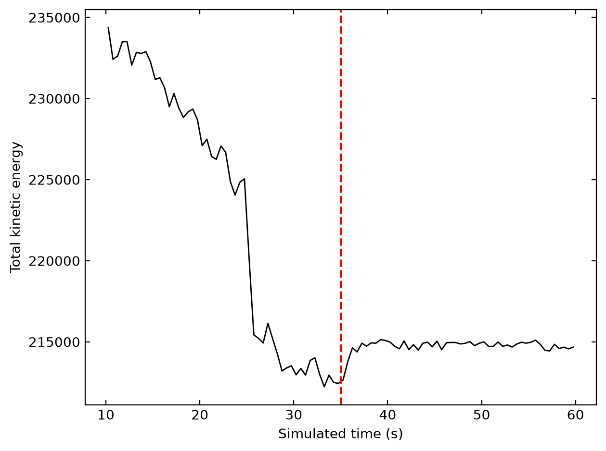

# Report

## 1. Introduction

The code in the repository is the base implementation that the rest was built off of. It documents the basic particle and wall interactions used, how the simulation updates, and how it measures and records the kinetic energy for graph plotting. This report documents the iterations that produced the final result.

## 2. Issue 1 — Kinetic Energy Varying Before Wall Removal

The first issue one will notice when running the code in the repository is the large variation in kinetic energy before the wall was removed. As this project set out to demonstrate cooling due to expansion, energy not being conserved before the gas was even allowed to expand was a major issue.

This was due to the starting configuration of the particles. Starting in random positions led to close-overlapping pairs releasing stored potential energy as huge bursts. The fix was to create a grid lattice to control the starting positions of the particles. As one will see in the final graph, this managed to reduce the energy change before the wall was removed, but it didn't remove it entirely. The long-term fix would be to choose the true equilibrium packing shape for the Lennard-Jones potential (a hexagonal lattice, rather than a square grid), which would require remodelling the walls to ensure there is no initial expansion.

## 3. Issue 2 — Kinetic Energy Rising When the Wall Was Removed

The second issue was that the code was not behaving as I had imagined. I set out to show that a gas will cool upon expansion, and instead got a heating effect. Understanding the Joule-Thomson coefficient meant this wasn't entirely shocking — depending on the shape and position of a particle's potential well, expansion can mean being pushed away (gaining KE) or being pulled apart (losing KE). With my current setup though, I was unable to demonstrate a cooling gas.

The problem was that the particles were behaving as a liquid rather than a free gas, due to their density in the confined space. Removing the wall meant these particles pushed each other apart, gaining kinetic energy as they did. The immediate fix would be to find the correct density to model a free gas, without so few particles that the effect becomes unnoticeable. This would take a number of iterations to find.

## 4. Underlying Issue — Timestep Resolution vs Real-Time Constraints

The underlying issue was that the rate at which the system updated forces couldn't keep up with the extremely strong, steep potential of the Lennard-Jones interaction. Particles were getting closer than they realistically should, because the force wasn't recalculated often enough to resolve the encounter, leading to huge unphysical bursts of kinetic energy. To fix this, a minimum distance between particles was enforced on the simulation to prevent this — but that then means particles are unable to get as close as they realistically would. This is a consequence of domestic modelling, and can only truly be resolved by updating the forces at diminishingly small time intervals. This fix is present in the repository to ensure a smooth, stable visual, but it is not a physically accurate one.

## 5. Result

**Figure 1.** *A graph showing the simulated kinetic energy against simulated time (s). The dotted red line represents the time at which the wall was removed. This graph was plotted using the corrections noted above, and is not a product of the base code in the repository.*

## 6. Conclusion

This project demonstrated the issues that arise when trying to simulate real physics without a huge computational cost. In this specific example, it was the fact that close encounters between particles swiftly broke energy conservation, due to the steep potential of the Lennard-Jones interaction. It also showed me how every detail — even something as simple as the number of particles used — can quickly turn the problem from modelling a free gas expected to cool into a liquid with overlapping potentials pushing each other apart.

The goal of this project was to understand these limitations and what would be needed to overcome them. As mentioned above, pursuing these corrections properly is unrealistic for at-home coding, but the understanding gained can be carried into any future simulation work in a professional environment.
